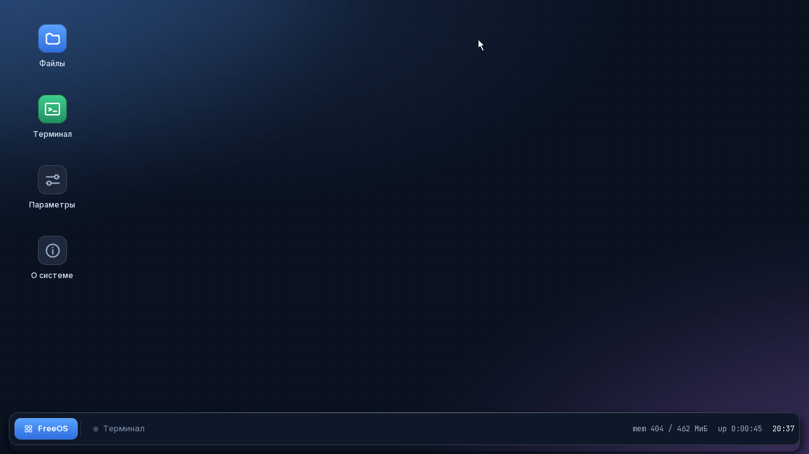
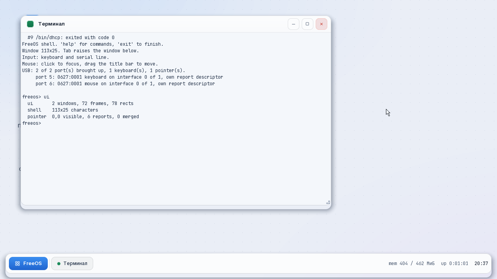
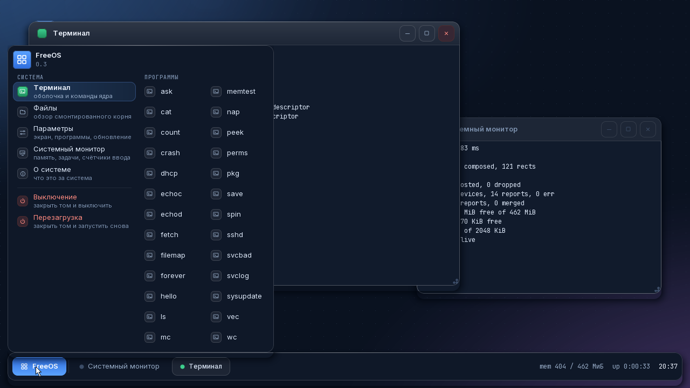
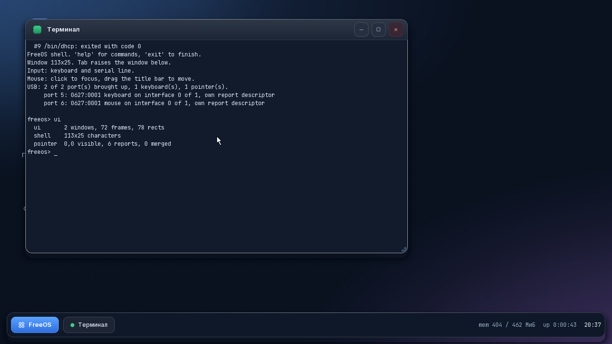
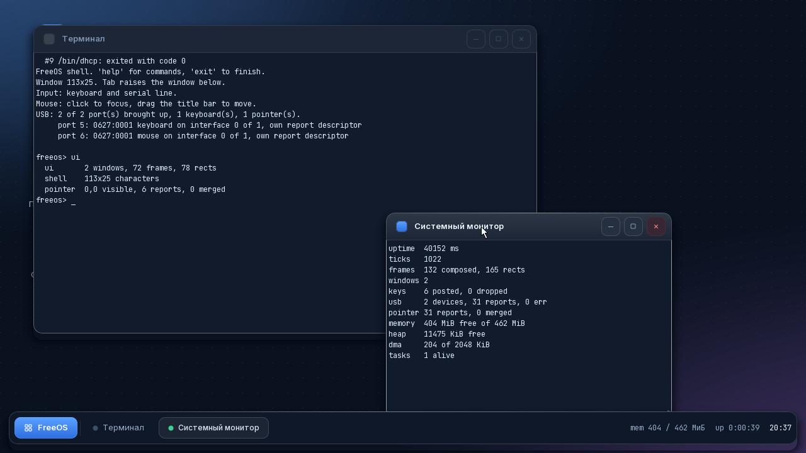
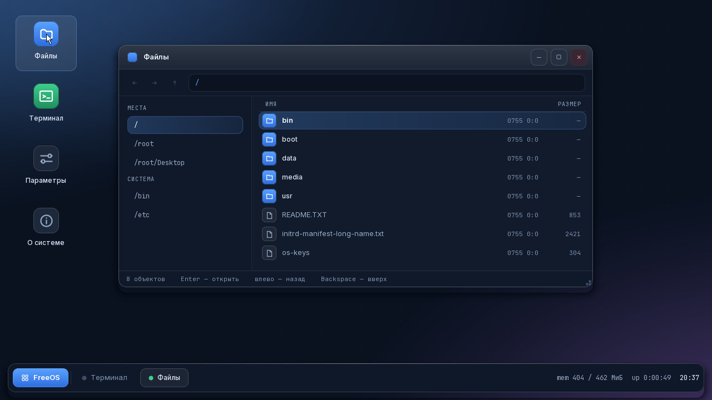
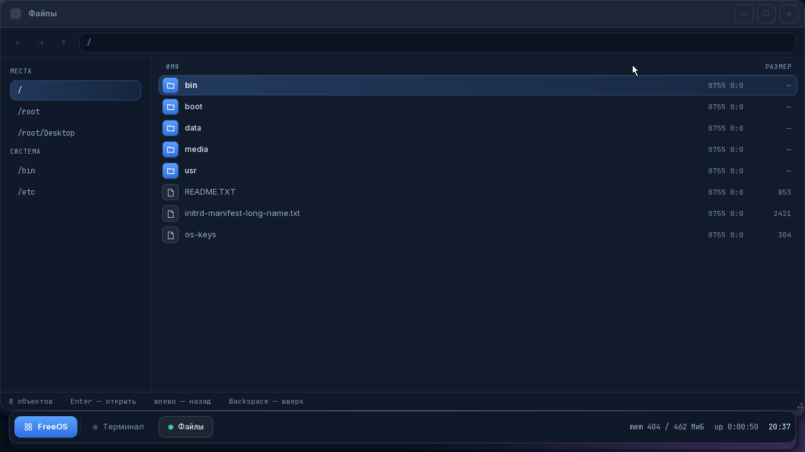
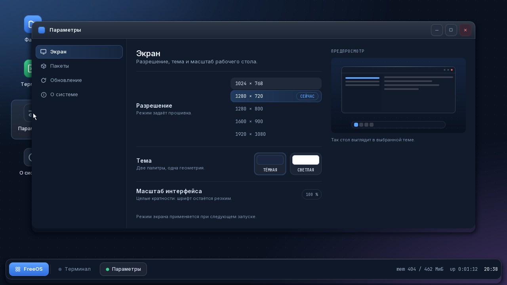
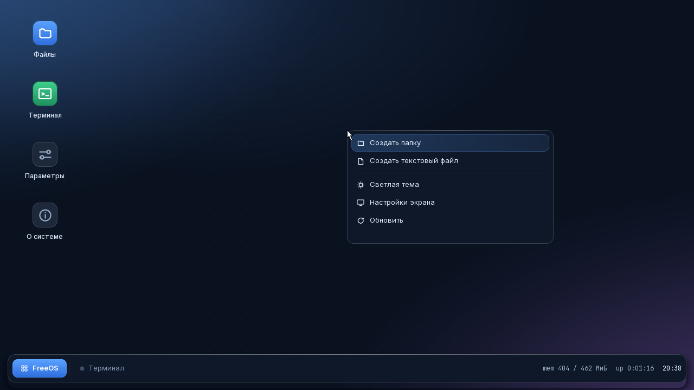
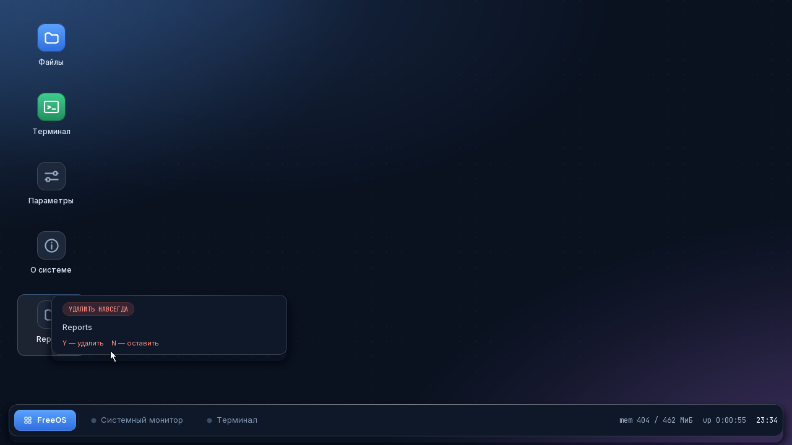

# Как это выглядит

Снимки сняты стендом в QEMU, экран 1280×720, сборка debug. Не постановочные: их
делает прогон сценария `mouse` между шагами, поэтому на них ровно то, что видит
человек, а не то, что хотелось бы показать.

Про то, из чего этот вид собран и какими числами задан, — [docs/LOOK.md](LOOK.md).

---

## Рабочий стол

Обои считаются, а не хранятся картинкой: световое пятно у верхнего края, два
размытых цветных круга по углам и сетка точек с шагом 24. Значки — плитки 46×46
со скруглением 13, подпись под каждой в две строки. Панель задач плавает: она
не приклеена к краю, а лежит с отступом 14 от всех трёх сторон.

## Та же система в светлой теме

Одна геометрия на обе палитры. Тема переключается правым щелчком по столу или в
«Параметрах»; перекрашивается всё сразу — обои, значки, панель, все открытые
окна и напечатанное в терминале.

## Меню запуска

Слева системные программы с пояснением под каждой, справа всё, что нашлось в
`/bin`. Выключение и перезагрузка отделены чертой и покрашены в красный: после
них ничего не вернуть.

## Терминал

Сетка символов набрана JetBrains Mono со сглаживанием. Колонки сходятся, потому
что начертание моноширинное — ширина ячейки берётся из самого шрифта, а не
объявляется рядом с ним.

## Два окна: активное и нет

Неактивное окно теряет градиент заголовка, светлую кромку и заливку кнопок.
Высота полосы при этом не меняется: иначе содержимое пересобирало бы раскладку
на каждом переключении окон.

## Файловый менеджер

Панель инструментов, боковая колонка с местами и системными каталогами, список
с плитками по типу записи. Первая косая в пути покрашена акцентом — по ней видно,
что это путь, а не текст.

Развёрнутое окно занимает рабочую область целиком, но углы остаются
скруглёнными: за ними видны обои.

## Параметры

Разделы слева, настройки справа, предпросмотр стола — если ширины хватает. Два
образца темы: действующий обведён акцентом. Список режимов приходит от прошивки,
а не придуман: написанное от руки «1234×567» она всё равно отвергнет.

## Меню стола

Пункт темы называется тем, что **произойдёт**, а не тем, что есть сейчас:
«Светлая тема» при включённой тёмной. Иначе он читается как признак, и человек
нажимает его, чтобы «включить», получая обратное.

## Переименование и удаление

Карточка меняет высоту вместе с тем, что в ней. Удаление спрашивает всегда:
корзины в системе нет, и отменить его нечем.
